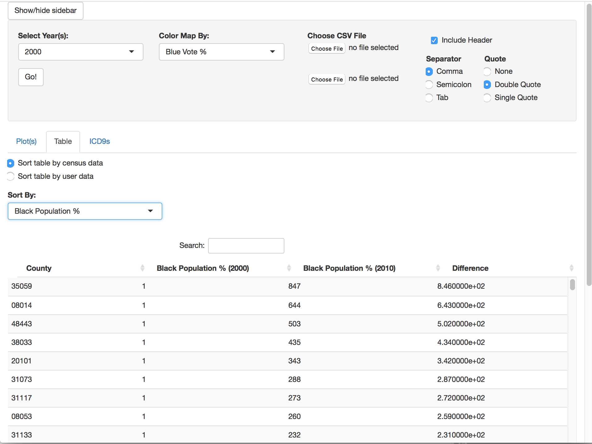
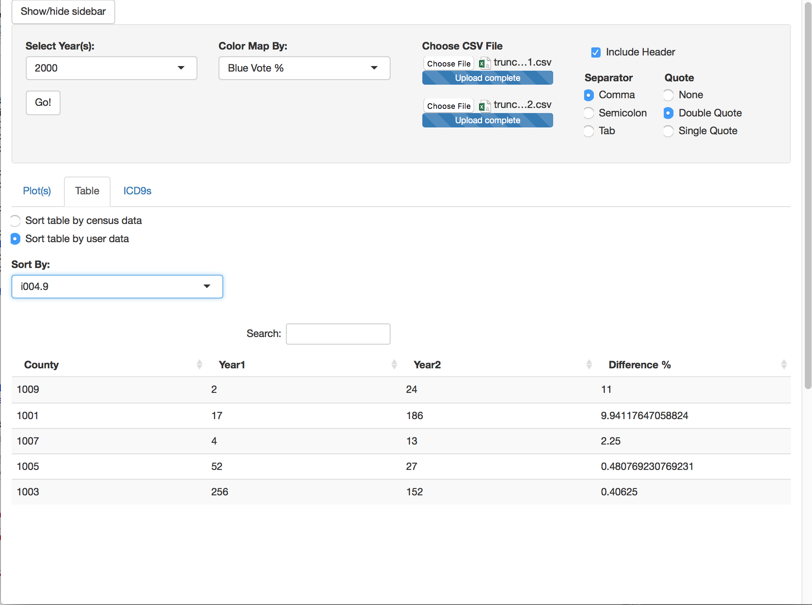

# CWAS_Census
A R/Shiny app that plots choropleth maps of the USA (by county) colored in density by median income, fraction of black/white demographics, total population, blue/red voting % and % below poverty. Uses choroplethR package in R.
Raw files were downloaded from the [2000 and 2010 Census](https://www.census.gov/support/USACdataDownloads.html) and selected columns were extracted into `/Data/Raw_All_2000.xlsx` and `/Data/Raw_All_2010.xlsx`. Column titles were changed before exporting to `/Data/ACS_2000.csv` and `/Data/ACS_2010.csv`. `cleanData.py` removes entries in the form xx000 (cumulate data for each state/unincorporated territory) and null values that arise for counties with population of 0 (30113, 51560, 51780). This data was staged in a local MySQL database. Note: Household income includes individuals who are single (the data we used). This is different from family income.

`censusPlot.R` demonstrates how choropleth plots may be generated. The code in `censusPlot.R` was copied over to the server-side script in the Shiny App. To run the Shiny App, click "Run App" after opening `/ShinyApp/server.R` in RStudio.

App functionality:
*  Plots choropleth maps of USA by parameter of user's choice using census data
*  Displays year-by-year comparison for a single variable against all counties, with either census data or data of user's choice
*  Displays ICD9 rates for user uploaded table
Below are plots of the USA colored by median income, black population, white population and total population by county.

Make sure to run devtools::install_github('rstudio/DT') (for the buttons in table download)
Also to rebuild choroplethr with the custom function, do this in the directory (after modifying usa.R):
[http://kbroman.org/pkg_primer/pages/build.html](http://kbroman.org/pkg_primer/pages/build.html)

[http://bootstraptaste.com/demo/Butterfly/](http://bootstraptaste.com/demo/Butterfly/)
library(devtools)

build()

install()

